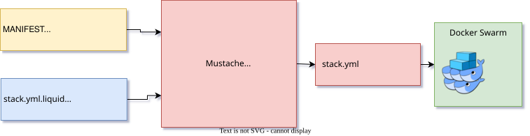

# HAProxy Deployment

- Upstream of this branch is https://github.com/edgebus/deployment-docker-swarm/tree/haproxy%23main
- How to use [EdgeBus Ops](https://docs.edgebus.io/ops/swarm) for Docker Swarm



## Automated Deploy

To launch automated deploy (via your CI/CD platform) use:

- push a commit (to create a deploy pipeline against `devel` cluster ONLY)
- create a tag (to create deploy pipelines against multiple clusters)

### Tags Format

|                   | Format                                | What to deploy                                               |
| ----------------- | ------------------------------------- | ------------------------------------------------------------ |
| Release Candidate | `haproxy[a-z]*-YYYYMMDDhhmmss-rcXxxx` | create deploy pipelines against ALL (except `prod`) clusters |
| Release           | `haproxy[a-z]*-YYYYMMDDhhmmss`        | create deploy pipelines against ALL clusters                 |

Examples:

- `haproxysomething-20250503-rc000`
- `haproxysomething-20250503-rc00`
- `haproxysomething-20250503-rc0`
- `haproxysomething-2025050323-rc0`
- `haproxysomething-202505032359-rc0`
- `haproxysomething-20250503235959-rc0`
- `haproxysomething-20250503`
- `haproxysomething-2025050323`
- `haproxysomething-202505032359`
- `haproxysomething-20250503235959`

### Commits

Commits trigger deploy to **devel** cluster ONLY.

## Manual Deploy

1. Prepare secrets
   ```shell
   mkdir .secrets
   ```
1. ```shell
   #
   ```
1. Export deployment variables
   ```shell
   export DEPLOYMENT_CLUSTER="devel"
   export DEPLOYMENT_STACK_NAME="cluster"
   export DEPLOYMENT_COMMIT="$(git rev-parse HEAD)"
   export DEPLOYMENT_JOB_ID="$(hostname -s)-$(date '+%Y%m%d%H%M%S')"
   export DEPLOYMENT_PIPELINE_URL="http://ci.example.org/job/42"
   export DEPLOYMENT_VERSION="$(git rev-parse --short HEAD)"
   ```
1. Generate Docker Stack fil
   ```shell
   cat stack.yml.mustache \
   | docker run --interactive --rm \
      --mount "type=bind,source=${PWD}/MANIFEST,target=/tmp/MANIFEST" \
      --mount "type=bind,source=${PWD}/MANIFEST-${DEPLOYMENT_CLUSTER},target=/tmp/MANIFEST-${DEPLOYMENT_CLUSTER}" \
      --env DEPLOYMENT_CLUSTER \
      --env DEPLOYMENT_COMMIT \
      --env DEPLOYMENT_JOB_ID \
      --env DEPLOYMENT_PIPELINE_URL \
      --env DEPLOYMENT_VERSION \
      theanurin/configuration-templates:20250503 \
         --engine mustache \
         --config-file="/tmp/MANIFEST" \
         --config-file="/tmp/MANIFEST-${DEPLOYMENT_CLUSTER}" \
         --config-env \
   | tee stack.local.yml
   ```
1. Bypass docker socket to your workstation as `~/tmp/docker-swarm.sock` (where `devel-01.example.org` is Docker Swarm manager node of a cluster)

   ```shell
   rm -f ~/tmp/docker-swarm.sock; ssh -N -L ~/tmp/docker-swarm.sock:/var/run/docker.sock devel-01.example.org

   export DOCKER_HOST=unix://$HOME/tmp/docker-swarm.sock
   ```

1. Deploy stack
   ```shell
   export DOCKER_HOST=unix://$HOME/tmp/docker-swarm.sock
   docker stack deploy --compose-file stack.local.yml  "${DEPLOYMENT_STACK_NAME}"
   ```
1. Monitoring
   ```shell
   export DOCKER_HOST=unix://$HOME/tmp/docker-swarm.sock
   docker stack ps               "${DEPLOYMENT_STACK_NAME}"
   docker service logs --follow  "${DEPLOYMENT_STACK_NAME}_haproxy"
   ```

## Setup

1. Mirror this branch to your repository
   ```shell
   TBD
   ```
1. Configure HAProxy
   ```shell
   cp -a etc/haproxy.cfg-example etc/haproxy.cfg
   vi etc/haproxy.cfg # modify for yourself
   ```
1. Commit changes and see for CD pipeline for deployment into `devel` cluster
1. Test Release Candidates to deploy pipelines against ALL (except `prod`) clusters
   1. Make tag in format `haproxy[a-z]*-rcXX`
   1. Start pipeline against the tag in your CI/CD platform
1. Test Release to deploy pipelines against ALL clusters
   1. Make tag in format `haproxy[a-z]*-YYYYMMDDxx`
   1. Start pipeline against the tag in your CI/CD platform
